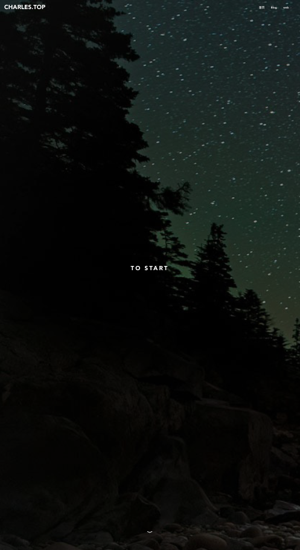

# feedback to 陈志初

> <u>本文档仅供参考（只是本人对于前端实现的建议，不涉及对作品本身的评价）</u>

---

<center>对手搓个人网站的勇士致以崇高的敬意</center>

<center>但还请注意</center>

<center><span style="color:red;">最好 · 不要 · 把 <code>dist</code> 和 <code>node_modules</code> 放进压缩包到处发！</span></center>

<center>=> 在 `.gitignore` 中忽略了不代表在打压缩包的时候也会消失</center>

---

<center>下面是对实现细节的一些建议，可以直接忽略</center>

### 1 封装 bannerList

目前看来 `bannerList1 ~ bannerLIst3` 具有较大的冗余性，建议再封装一层：

> 保持 `.titleName` 先于 `.bannerBox` 的 `template` 结构

- 参数列表

  ```json
  {
    // optional
    alignRight: true / false, // => defalt: false, 控制 slider 居左 / 居右
    option: {},               // => 配置项，没有就用默认的
    // required
    content: {
    	titleName: "",
    	contentTitle: "",
    	someList: {}
  	}
  }
  ```

- 根据 `alignLeft` 使用 `flex-direction` 控制 slider 位置（默认居左）

  ```html
   <div :class="alignRight ? 'blogBox right' : 'blogBox'">
  ```

  ```css
  .blogBox {
    flex-direction: row;
  }
  .blogBox.right {
    flex-direction: row-reverse;
  }
  
  /* 严格左右交替的话甚至可以省略 aignRight */
  .blogBox:nth-of-type(2n) { /* 选择偶数个 */
    flex-direction: row-reverse;
  }
  ```

### 2 enter-active-class

直接拿 `display: none` 解决 *'抖动'* 有点太果断了（退场动画直接被砍了好吗！）

> 目前看起来是 切入/切出 动画重叠导致的（？存疑）

=> 改成下面这样稍微好点：

```html
<transition class="auto-scroll" 
 ...
  enter-active-class="animate__backInUp animate__slow animate__delay-1s" 
 ...>
```

### 3 自适应

一些大概是 `amfe-flexible`  引发的 bug：

- 似乎没有正确应用到 `go-top` 按钮上 (?)，宽度不够时看不到按钮

- 会影响 `locked` 的计算准确性（如下图）

  => 目测是因为 `bannerH` 仅在 mouted 时被计算，而在 `window.resize` 时没有被及时更新
  

---

> 以及个人觉得 `amfe-flexible`  以 viewWidth 来缩放设计稿并不是一个合理的解决方案（传统意义上的自适应应该是类似于 Bootstrap 的响应式方案？）

<center>至少在屏宽度小的时候不太妙</center>



---

另外，HomeView 的背景填充在偏带鱼屏比例时有 bug

> => 建议为 `.home` 添加 `background-size: cover;`


### 4 TypeWriter

手搓值得尊敬，但其实有更成熟的解决方案 —— [typedJS](https://github.com/mattboldt/typed.js/)

> => 说实话我觉得这玩意儿最痛苦的地方在于怎么定位结尾的光标 orz

###  5 (可忽略) 页面设计 

- TypeWriter 的容器最好预设足够的高度， “首页” 和 “Blog” 跟着输出字符下移会有一点抽象

- Slider 的索引点有点小了 + 默认样式和背景图片的对比度不高，用户手动点击进行滚动比较困难

  => 建议还是预设 autoplay，然后在通过监听鼠标 移入/移出 分别 停止/开始 自动播放

- GitHub 的默认 Markdown 实在称不上美观 orz，直接当 Blog 主题可能会有一点抽象

  => 可以去 [Typora](https://theme.typoraio.cn/)（或者其他地方）掏一份好的 Markdown 主题，然后用 SCSS 在外面包一层 `.markdown-body` 选择器

- 不太建议用 element UI 的组件（好歹覆盖一下 dialogBox 的样式鸭）